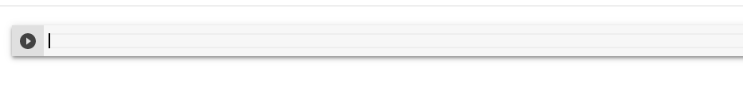
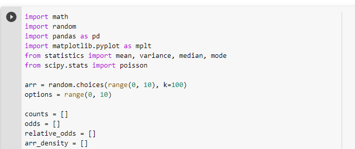
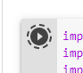
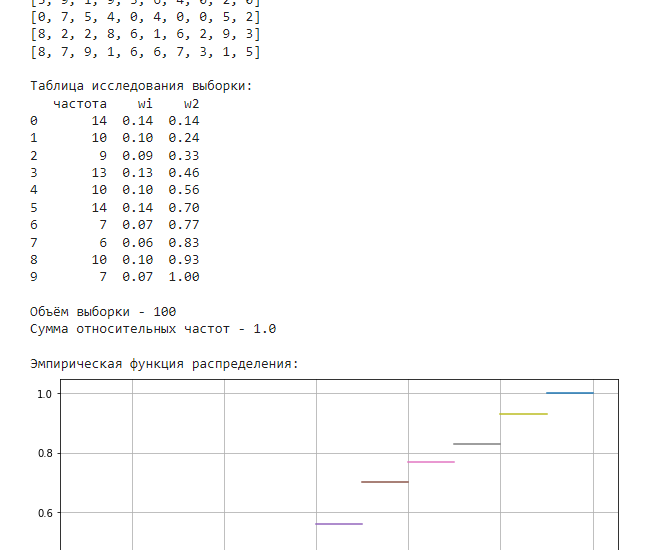

# Инструкция по запуску

## Зайти на сайт

https://colab.research.google.com/

### Создать блокнот и в него  вставить код
1) 

2)

3) Нажать на запуск

4) В секции после кода будет показан результат работы программы

